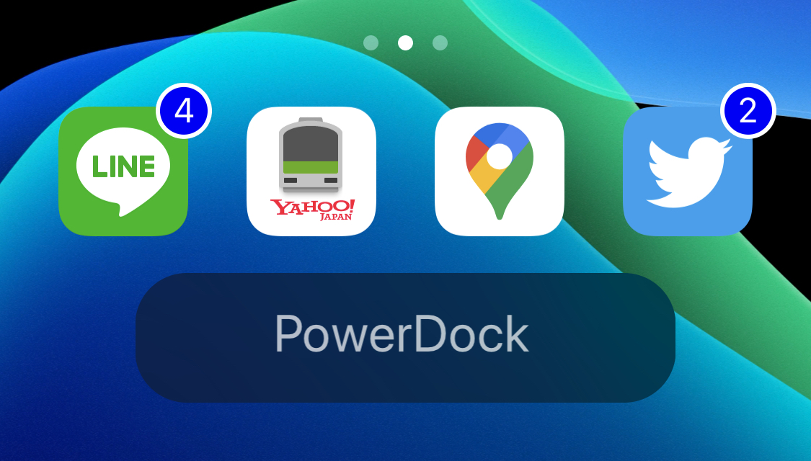

<h1 align="center">PowerDock</h1>

**Choose a power option.**

Twitter         - [@Minazuki_dev](https://twitter.com/Minazuki_dev)

## PowerDock
ネタTweakとして最初は作り始めたのですが、テスターの方達に便利と言われたのでちょっと頑張って機能を増やしました。バグはTwitterやLINEのオープンチャットで教えてくれるとありがたいです。動作報告やバグ報告と同時にどのSpringBoard系のTweakと共存できたのかも教えてほしいです。

使用する前に以下のリポジトリを追加してください。
- https://mikiyan1978.github.io/repository/
- https://minazukidev.github.io

## Compatibility

- iOS 13~13.3 (iOS12はKill All Appsが動きません)
- arm64 & arm64e
[アーキテクチャ確認はここから](https://qiita.com/takkyun/items/814aa45beee422a5f0c6)

## 機能
- Respring
- Reboot
- Safe mode
- Power down
- UICache (Beta)
- Kill All Apps
- Kill Process

- 角の変更
- ドックの高さ変更
- 文字の大きさ変更
- 文字の透明度変更

## 確認済みバグ
- Height, Radius,が2回Respringしないと反映されない

## 修正済みバグ
- Respring後にすぐタップするとアラートが消える
- アプリを閉じですぐにタップするとアラートが消える

## SB系の共存できたTweak
- HomePlus Beta

## SB系の共存不可Tweak
- FloatingDockPlus13

## Special thanks
-SsS136        - [@DevTweak](https://twitter.com/DevTweak)
-Dcsyhi        - [@linux_n1](https://twitter.com/linux_n1)

## Copyright
@Minazuki_dev 2020

